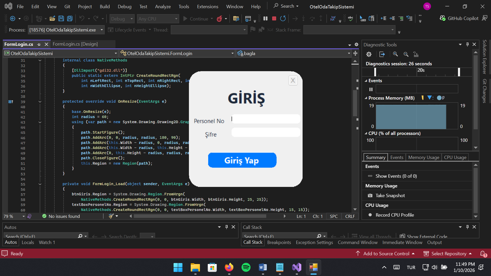
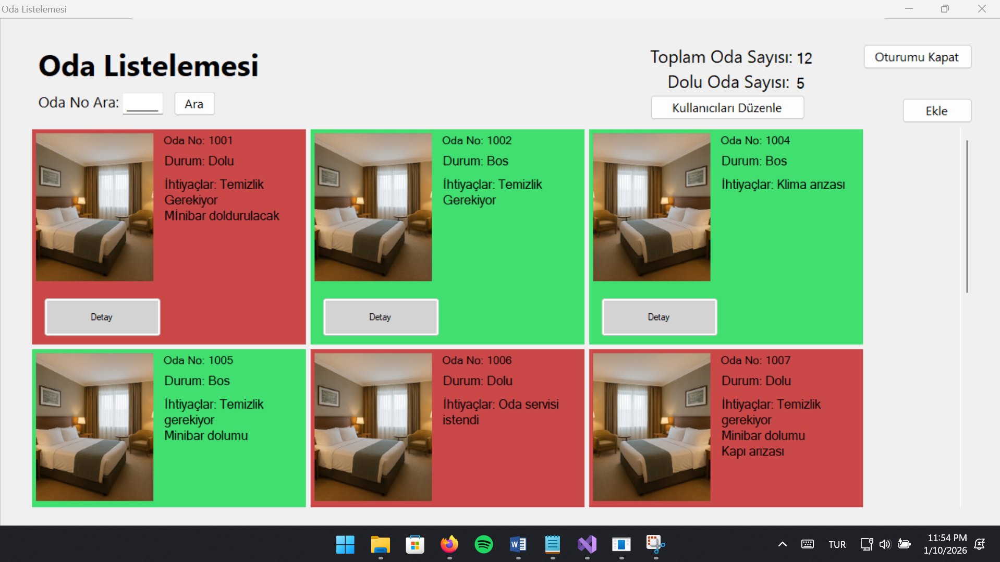
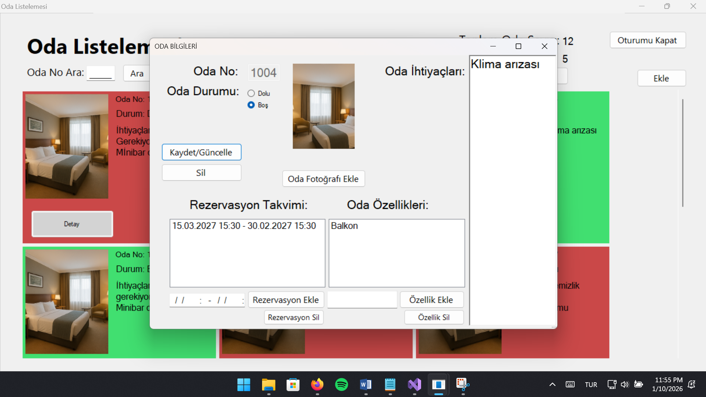

# 🏨 Hotel Room Management System (Otel Oda Takip Sistemi)

> A comprehensive, modern desktop application tailored for the hospitality domain. Designed to digitize and automate room tracking, reservations, and personnel management, this system consists of independent yet complementary modules, ensuring high functionality, clean code architecture, and a seamless user experience.

## 🚀 System Modules & Key Features

### 1. Login Module (`FormLogin`)
*   **Authentication:** Securely verifies the user's *Personel No* and *Password* against the database.
*   **Role-Based Routing:** Upon successful login, the system automatically routes the user to the main dashboard with privileges tailored to their authorization level.
*   **Error Handling:** Displays a *"Personel No veya Şifre yanlış tekrar deneyiniz!"* warning for invalid credentials, blocking unauthorized access.

### 2. Main Dashboard (`FormUserInterface`)
*   **Centralized Room Tracking:** Displays all hotel rooms in a dynamic layout, offering a unified view of room numbers, statuses, and properties.
*   **Dynamic UI via Roles:**
    *   *Standard Personnel* can view room properties, search rooms, view total/occupied statistics, and log out.
    *   *Administrators* gain additional access to **"Kullanıcıları Düzenle"** (Edit Users) and **"Ekle"** (Add Room) functionalities.
*   **Quick Search & Navigation:** Search directly by Room No. Clicking the **"Detay"** (Detail) button on any room card seamlessly opens its specific management panel.
*   **Live Statistics:** The top-right panel constantly updates total and occupied room metrics.

### 3. Room Management (`FormOdaDuzenle`)
*   **Comprehensive Details:** View and update Oda Durumu (Status), Oda Özellikleri (Features), Oda Görseli (Image), Oda No, Oda İhtiyaçları (Needs), and Rezervasyon Takvimi (Reservation Calendar).
*   **Add & Update:** Fill in all required fields to register a new room or update an existing one. Triggers a *"Lütfen Tüm Bilgileri Doldurduğunuzdan Emin Olun!"* warning if fields are missing.
*   **Safe Deletion:** Deleting a room prompts a confirmation dialog (*"Odayı silmek istediğinize emin misiniz?"*). Approved deletions instantly refresh the main dashboard.

### 4. User Management (`FormKullanicilariDuzenle`)
*   **Exclusive Admin Access:** Allows administrators to view all registered personnel.
*   **Add & Format Validation:** Add new staff members with strict format checking (*"Lütfen verileri doğru formatta girin"*).
*   **Role Assignment:** Dynamically assign authorization levels.
*   **Protection:** Prevents deletion of the primary administrator account (*"Ana Kullanıcı Silinemez!"*).

## 📖 Usage Instructions

1.  **Starting the App:** Launch the application and you will be greeted by the `FormLogin` screen.
2.  **Logging In:** 
    *   Enter an Admin credential (e.g., `1234` / `1234`) to access all features.
    *   Enter a Standard credential (e.g., `4321` / `4321`) to access the view-only dashboard.
3.  **Navigating the Dashboard:** You will see a list of dynamically generated room cards. Green indicates available; Red indicates occupied. Live stats are visible at the top right.
4.  **Managing a Room:** Click the **"Detay"** button on a room card. A new window will appear where you can update the room's status (Dolu/Boş), add needs, and view reservations. Click "Kaydet/Güncelle" to save.
5.  **Adding a Room (Admin Only):** Click the **"Ekle"** button on the dashboard. Fill out all details including the room image, and save.
6.  **Managing Users (Admin Only):** Click **"Kullanıcıları Düzenle"**. Here you can register new personnel, assign their roles, or remove inactive users (except the main admin).
7.  **Logging Out:** Use the "Oturumu Kapat" button to safely return to the login screen.

## 🛠 Tech Stack

*   **Language:** C# (.NET Framework)
*   **UI Framework:** Windows Forms (WinForms)
*   **Database:** Microsoft SQL Server (LocalDB)
*   **Data Access:** ADO.NET
*   **IDE:** Visual Studio 2022

## 🏗 Software Architecture & OOP Principles

This codebase is strictly engineered using foundational Object-Oriented Programming (OOP) principles to enforce clean architecture, low coupling, and high cohesion:

*   **Abstraction & Inheritance:** The `TemelPersonel` abstract base class defines core employee properties. `YoneticiPersonel` and `StandartPersonel` inherit from this base.
*   **Polymorphism:** The abstract method `YonetimPaneliErisimi()` is overridden to return `true` for Admins and `false` for Standard Users, dictating dynamic UI generation.
*   **Interfaces:** `IOdaIslemleri` establishes a strict contract (`Ekle`, `Guncelle`, `Sil`) implemented by the `OdaYonetimi` business class.
*   **Encapsulation:** The `Oda` entity strictly encapsulates properties (e.g., throwing exceptions for negative room numbers).
*   **Static Usage:** A static `VeritabaniAyarlari` utility class centrally manages dynamic, relative database connection strings.

## 🗄️ Database Structure

*   **`PersonelInformation` (PersonelKayitlari.mdf):** Secures employee credentials and role flags (`Admin` bit).
*   **`OdaBilgileri` (OdaBilgileri.mdf):** Stores room metrics, statuses, textual properties, and native images via `varbinary(MAX)`.

## 📸 Screenshots

## ⚙️ Setup & Installation

1.  **Clone or Extract** the repository.
2.  Open `OtelOdaTakipSistemi.sln` using **Visual Studio 2022**.
3.  **Database Requirement:** Ensure Microsoft SQL Server **LocalDB** is installed (approx. 80MB).
4.  **Dependencies Warning:** Click **"Yes"** if Visual Studio prompts to restore missing NuGet packages.
5.  Press **Ctrl + Shift + B** to build.
6.  Press **Start (F5)** to run. The `.mdf` files in the `VeriTabani` folder will attach automatically.

## 🔐 Test Credentials

| Role Type | Username (Personel No) | Password |
| :--- | :--- | :--- |
| **Administrator** | `1234` | `1234` |
| **Standard User** | `4321` | `4321` |
